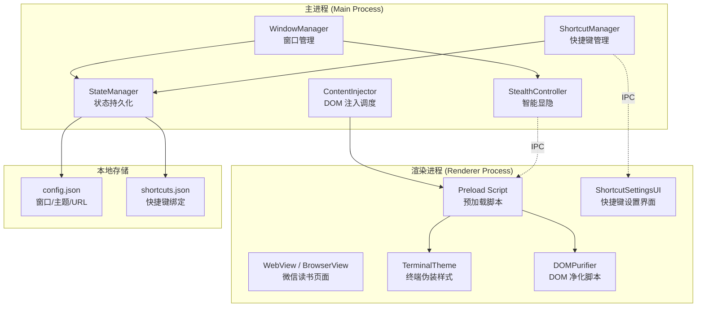
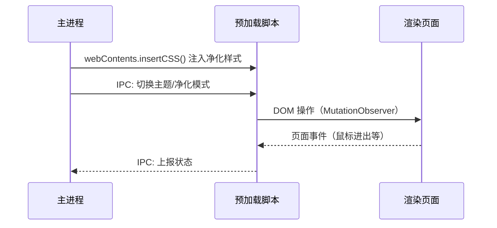

# 技术设计文档：沉浸式隐蔽小说阅读器

## 概述

本应用是一款基于 Electron 的桌面阅读器，核心目标是在办公环境中提供隐蔽的网页阅读体验。技术上通过无边框透明窗口 + DOM 注入净化 + 终端伪装主题三层机制实现。

主要技术决策：
- **运行时**：Electron（主进程 + 渲染进程架构）
- **语言**：JavaScript/TypeScript（主进程和预加载脚本）
- **配置存储**：`electron-store` 或原生 JSON 文件读写
- **DOM 注入**：通过 `webContents.insertCSS()` 和预加载脚本注入
- **窗口控制**：Electron BrowserWindow API（透明度、点击穿透、置顶）

架构上采用 Electron 标准的主进程/渲染进程分离模型，通过 IPC 通信协调各模块。

## 架构

### 整体架构图



### 进程通信模型



## 组件与接口

### 1. WindowManager（窗口管理器）

负责创建和管理主窗口的生命周期。

```typescript
interface WindowManagerConfig {
  width: number;          // 默认 800
  height: number;         // 默认 600
  x?: number;             // 窗口 x 坐标
  y?: number;             // 窗口 y 坐标
  alwaysOnTop: boolean;   // 是否置顶，默认 false
  defaultUrl: string;     // 默认加载 URL
}

class WindowManager {
  // 创建无边框透明窗口
  createWindow(config: WindowManagerConfig): BrowserWindow;
  // 获取当前窗口实例
  getWindow(): BrowserWindow | null;
  // 获取当前窗口位置和尺寸
  getBounds(): Electron.Rectangle;
  // 加载指定 URL
  loadURL(url: string): Promise<void>;
}
```

### 2. StealthController（智能显隐控制器）

控制窗口的透明度和点击穿透状态。

```typescript
class StealthController {
  // 当前是否可见
  private visible: boolean;

  // 显示窗口（不透明度 → 1.0，关闭点击穿透）
  show(): void;
  // 隐藏窗口（不透明度 → 0.0，开启点击穿透）
  hide(): void;
  // 切换显隐状态
  toggle(): void;
  // 获取当前可见状态
  isVisible(): boolean;
}
```

### 3. ContentInjector（内容注入器）

负责向 WebContents 注入 CSS/JS 以净化页面和应用主题。

```typescript
interface PurifyRule {
  selector: string;       // CSS 选择器
  action: 'hide' | 'remove'; // 隐藏或移除
}

class ContentInjector {
  // 注入净化 CSS（隐藏导航栏、侧边栏等）
  injectPurifyStyles(webContents: WebContents): Promise<void>;
  // 注入终端伪装主题
  injectTerminalTheme(webContents: WebContents): Promise<void>;
  // 移除终端伪装主题
  removeTerminalTheme(webContents: WebContents): Promise<void>;
  // 切换净化模式
  togglePurify(): void;
  // 切换终端主题
  toggleTerminalTheme(): void;
  // 获取净化模式状态
  isPurifyEnabled(): boolean;
  // 获取终端主题状态
  isTerminalThemeEnabled(): boolean;
}
```

### 4. ShortcutManager（快捷键管理器）

管理全局快捷键的注册、注销和自定义。

```typescript
interface ShortcutBinding {
  action: string;         // 操作名称
  accelerator: string;    // 快捷键组合，如 "Ctrl+Shift+H"
}

interface ShortcutConflict {
  action: string;
  accelerator: string;
  conflictWith: string;   // 冲突的操作名
}

class ShortcutManager {
  // 注册所有快捷键
  registerAll(bindings: ShortcutBinding[]): void;
  // 注销所有快捷键
  unregisterAll(): void;
  // 更新单个快捷键绑定
  updateBinding(action: string, newAccelerator: string): ShortcutConflict | null;
  // 检测快捷键冲突
  detectConflict(accelerator: string, excludeAction?: string): ShortcutConflict | null;
  // 恢复默认快捷键
  resetToDefaults(): ShortcutBinding[];
  // 获取所有当前绑定
  getAllBindings(): ShortcutBinding[];
  // 获取默认绑定
  getDefaultBindings(): ShortcutBinding[];
}
```

### 5. StateManager（状态管理器）

负责应用状态的持久化读写。

```typescript
interface AppState {
  window: {
    x: number;
    y: number;
    width: number;
    height: number;
  };
  theme: {
    terminalEnabled: boolean;
  };
  url: string;
  alwaysOnTop: boolean;
}

class StateManager {
  // 加载状态（文件不存在或损坏时返回默认值）
  load(): AppState;
  // 保存状态
  save(state: AppState): void;
  // 获取默认状态
  getDefaults(): AppState;
}
```


### 6. ShortcutSettingsUI（快捷键设置界面）

渲染进程中的快捷键配置面板，通过 IPC 与主进程通信。

```typescript
// IPC 通道定义
const IPC_CHANNELS = {
  GET_SHORTCUTS: 'shortcuts:get-all',
  UPDATE_SHORTCUT: 'shortcuts:update',
  RESET_SHORTCUTS: 'shortcuts:reset',
  SHORTCUT_CONFLICT: 'shortcuts:conflict',
  TOGGLE_SETTINGS: 'shortcuts:toggle-settings',
} as const;
```

### 模块间 IPC 通信协议

| 通道名 | 方向 | 数据 | 说明 |
|--------|------|------|------|
| `stealth:show` | 主→渲染 | - | 通知渲染进程窗口已显示 |
| `stealth:hide` | 主→渲染 | - | 通知渲染进程窗口已隐藏 |
| `theme:toggle` | 主→渲染 | `boolean` | 切换终端主题 |
| `purify:toggle` | 主→渲染 | `boolean` | 切换净化模式 |
| `shortcuts:get-all` | 渲染→主 | - / `ShortcutBinding[]` | 获取所有快捷键绑定 |
| `shortcuts:update` | 渲染→主 | `{action, accelerator}` | 更新快捷键 |
| `shortcuts:reset` | 渲染→主 | - / `ShortcutBinding[]` | 恢复默认快捷键 |
| `navigate:url` | 渲染→主 | `string` | 导航到指定 URL |
| `mouse:enter` | 渲染→主 | - | 鼠标进入窗口 |
| `mouse:leave` | 渲染→主 | - | 鼠标离开窗口 |

## 数据模型

### 配置文件结构

应用使用两个 JSON 配置文件，存储在 Electron 的 `userData` 目录下。

#### config.json — 应用状态

```json
{
  "window": {
    "x": 100,
    "y": 100,
    "width": 800,
    "height": 600
  },
  "theme": {
    "terminalEnabled": false
  },
  "url": "https://weread.qq.com",
  "alwaysOnTop": false
}
```

#### shortcuts.json — 快捷键绑定

```json
{
  "toggleVisibility": "Ctrl+Shift+H",
  "toggleTerminalTheme": "Ctrl+Shift+T",
  "togglePurify": "Ctrl+Shift+C",
  "openAddressBar": "Ctrl+L",
  "quitApp": "Ctrl+Q",
  "openShortcutSettings": "Ctrl+Shift+K"
}
```

### 默认快捷键映射

| 操作名 | 默认快捷键 | 说明 |
|--------|-----------|------|
| `toggleVisibility` | `Ctrl+Shift+H` | 显隐切换 |
| `toggleTerminalTheme` | `Ctrl+Shift+T` | 终端主题切换 |
| `togglePurify` | `Ctrl+Shift+C` | 净化模式切换 |
| `openAddressBar` | `Ctrl+L` | 打开地址栏输入 URL |
| `quitApp` | `Ctrl+Q` | 退出应用 |
| `openShortcutSettings` | `Ctrl+Shift+K` | 打开快捷键设置 |

### 净化规则数据

```typescript
// 微信读书页面净化规则（预定义）
const WEREAD_PURIFY_RULES: PurifyRule[] = [
  { selector: '.readerTopBar', action: 'hide' },           // 顶部导航栏
  { selector: '.readerFooter', action: 'hide' },           // 底部工具栏
  { selector: '.readerControls', action: 'hide' },         // 阅读控制面板
  { selector: '.shelf_list', action: 'hide' },             // 书架列表
  { selector: '.readerCatalog', action: 'hide' },          // 目录面板
  { selector: '.avatar', action: 'hide' },                 // 用户头像
  { selector: '.readerComment', action: 'hide' },          // 评论区
  { selector: '.readerSocial', action: 'hide' },           // 社交元素
  { selector: '[class*="background"]', action: 'hide' },   // 背景装饰
];
```

### 终端伪装主题样式

```css
/* 终端伪装核心样式 */
body {
  background-color: #000000 !important;
  color: #00FF00 !important;
  font-family: Consolas, "Fira Code", "Courier New", monospace !important;
}

/* 段落行号前缀通过 JS 动态添加 CSS counter */
.reader_content p {
  counter-increment: line-number;
}
.reader_content p::before {
  content: counter(line-number, decimal-leading-zero) " $ ";
  color: #00AA00;
  opacity: 0.6;
}

/* 隐藏所有图片 */
img, picture, svg, canvas {
  display: none !important;
}
```


## 正确性属性

*属性是指在系统所有有效执行中都应保持为真的特征或行为——本质上是对系统应做什么的形式化陈述。属性是人类可读规格说明与机器可验证正确性保证之间的桥梁。*

### 属性 1：净化规则应用完整性

*对于任意*净化规则集合中的选择器，当净化模式开启并注入到页面后，该选择器匹配的所有 DOM 元素应处于不可见状态（`display: none` 或 `visibility: hidden`）。

**验证需求：4.1, 4.2, 4.3, 4.4, 4.5**

### 属性 2：显隐状态与操作一致性

*对于任意*初始可见状态，调用 `show()` 后窗口不透明度应为 1.0，调用 `hide()` 后窗口不透明度应为 0.0。即 StealthController 的显隐操作结果应始终与调用的方法语义一致。

**验证需求：2.1, 2.2**

### 属性 3：隐藏状态不变量

*对于任意*隐藏操作执行后的窗口状态，窗口实例应仍然存在（未被销毁），且点击穿透（`setIgnoreMouseEvents`）应处于开启状态。

**验证需求：2.3, 2.4**

### 属性 4：显隐切换往返

*对于任意*初始显隐状态，执行两次 `toggle()` 操作后，窗口的可见状态应与初始状态相同。

**验证需求：2.5**

### 属性 5：DOM 变更后净化规则持续生效

*对于任意*已开启净化模式的页面，当发生 DOM 变更（新增节点）后，净化规则应被重新应用，新增的匹配净化选择器的元素同样应处于不可见状态。

**验证需求：4.7**

### 属性 6：净化模式切换往返

*对于任意*初始净化模式状态，执行两次净化模式切换后，净化模式的开启/关闭状态应与初始状态相同。

**验证需求：4.8**

### 属性 7：终端主题样式完整性

*对于任意*激活终端主题的页面，页面应同时满足：背景色为 `#000000`、文字颜色为 `#00FF00`、字体族包含等宽字体（Consolas / Fira Code / Courier New）、所有图片元素不可见。

**验证需求：5.1, 5.2, 5.3, 5.5**

### 属性 8：终端主题行号前缀

*对于任意*激活终端主题的页面中的段落元素，每个段落前应存在行号前缀（如 `$ `、`> ` 或递增数字），且行号应按段落顺序递增。

**验证需求：5.4**

### 属性 9：终端主题切换往返

*对于任意*初始终端主题状态，执行两次终端主题切换后，主题的开启/关闭状态应与初始状态相同。

**验证需求：5.6**

### 属性 10：快捷键配置序列化往返

*对于任意*有效的快捷键绑定集合（`ShortcutBinding[]`），将其序列化为 JSON 后再反序列化，应得到与原始集合等价的绑定。同时，对于任意操作和有效快捷键组合，更新绑定后查询该操作应返回新的快捷键。

**验证需求：6.4, 6.6**

### 属性 11：快捷键冲突检测

*对于任意*快捷键绑定集合，如果两个不同操作被绑定到相同的快捷键组合，`detectConflict()` 应返回非空的冲突信息，标明冲突的操作名。

**验证需求：6.7**

### 属性 12：恢复默认快捷键幂等性

*对于任意*修改后的快捷键配置，执行 `resetToDefaults()` 后，所有绑定应等于预定义的默认快捷键映射。且连续执行多次 `resetToDefaults()` 结果应相同（幂等性）。

**验证需求：6.8**

### 属性 13：应用状态持久化往返

*对于任意*有效的 `AppState` 对象（包含窗口位置/尺寸、主题状态、URL），调用 `save()` 后再调用 `load()`，应得到与原始状态等价的对象。

**验证需求：7.1, 7.2, 7.3, 7.4, 5.7**

## 错误处理

### 页面加载失败

- 当 `webContents` 触发 `did-fail-load` 事件时，在窗口内渲染错误提示页面
- 错误页面包含：错误描述文本 + 重试按钮
- 重试按钮点击后重新加载当前 URL
- 对应需求 3.3

### 配置文件损坏或缺失

- `StateManager.load()` 使用 try-catch 包裹 JSON 解析
- 解析失败时返回 `getDefaults()` 的默认值
- 同时创建新的配置文件覆盖损坏文件
- 对应需求 7.5

### 快捷键注册失败

- `globalShortcut.register()` 返回 `false` 时记录日志警告
- 日志包含：失败的快捷键组合 + 可能的冲突原因
- 不阻塞应用启动，其他快捷键继续注册
- 对应需求 6.3

### DOM 注入异常

- `webContents.insertCSS()` 和 `webContents.executeJavaScript()` 使用 try-catch
- 注入失败时记录错误日志，不影响应用主流程
- MutationObserver 断开连接时自动重新创建

## 测试策略

### 测试框架选型

- **单元测试**：Jest（Electron 项目的标准选择）
- **属性测试**：fast-check（JavaScript/TypeScript 生态中最成熟的属性测试库）
- **E2E 测试**：Playwright 或 Spectron（可选，用于 UI 交互验证）

### 单元测试覆盖

单元测试聚焦于具体示例、边界情况和错误条件：

- **WindowManager**：验证默认配置值（800×600、frameless、非置顶）
- **StealthController**：验证 show/hide 的具体状态变化
- **ContentInjector**：验证净化规则列表包含所有必需选择器
- **ShortcutManager**：验证默认快捷键映射表完整性
- **StateManager**：验证配置文件不存在时返回默认值、JSON 损坏时的容错处理
- **错误处理**：验证页面加载失败时的错误提示生成

### 属性测试覆盖

属性测试使用 fast-check 库，每个属性测试至少运行 100 次迭代。每个测试必须通过注释引用设计文档中的属性编号。

注释格式：**Feature: stealth-novel-reader, Property {编号}: {属性描述}**

每个正确性属性由一个独立的属性测试实现：

| 属性编号 | 测试描述 | 生成器策略 |
|---------|---------|-----------|
| P1 | 净化规则应用完整性 | 生成随机 CSS 选择器集合，验证注入后元素隐藏 |
| P2 | 显隐状态与操作一致性 | 生成随机初始状态序列，验证 show/hide 结果 |
| P3 | 隐藏状态不变量 | 生成随机操作序列，验证隐藏后窗口存在且点击穿透 |
| P4 | 显隐切换往返 | 生成随机初始状态，验证双次 toggle 回到原状态 |
| P5 | DOM 变更后净化持续生效 | 生成随机 DOM 节点插入，验证净化规则重新应用 |
| P6 | 净化模式切换往返 | 生成随机初始状态，验证双次切换回到原状态 |
| P7 | 终端主题样式完整性 | 生成随机页面内容，验证主题激活后所有样式规则生效 |
| P8 | 终端主题行号前缀 | 生成随机段落数量和内容，验证行号递增且格式正确 |
| P9 | 终端主题切换往返 | 生成随机初始状态，验证双次切换回到原状态 |
| P10 | 快捷键配置序列化往返 | 生成随机 ShortcutBinding 数组，验证 JSON 序列化/反序列化等价 |
| P11 | 快捷键冲突检测 | 生成随机绑定集合（含重复快捷键），验证冲突检测正确 |
| P12 | 恢复默认快捷键幂等性 | 生成随机修改后的配置，验证 reset 后等于默认值 |
| P13 | 应用状态持久化往返 | 生成随机 AppState 对象，验证 save/load 往返等价 |

### 测试组织结构

```
tests/
├── unit/                          # 单元测试
│   ├── window-manager.test.ts
│   ├── stealth-controller.test.ts
│   ├── content-injector.test.ts
│   ├── shortcut-manager.test.ts
│   └── state-manager.test.ts
└── property/                      # 属性测试
    ├── stealth-controller.prop.ts
    ├── content-injector.prop.ts
    ├── shortcut-manager.prop.ts
    └── state-manager.prop.ts
```
